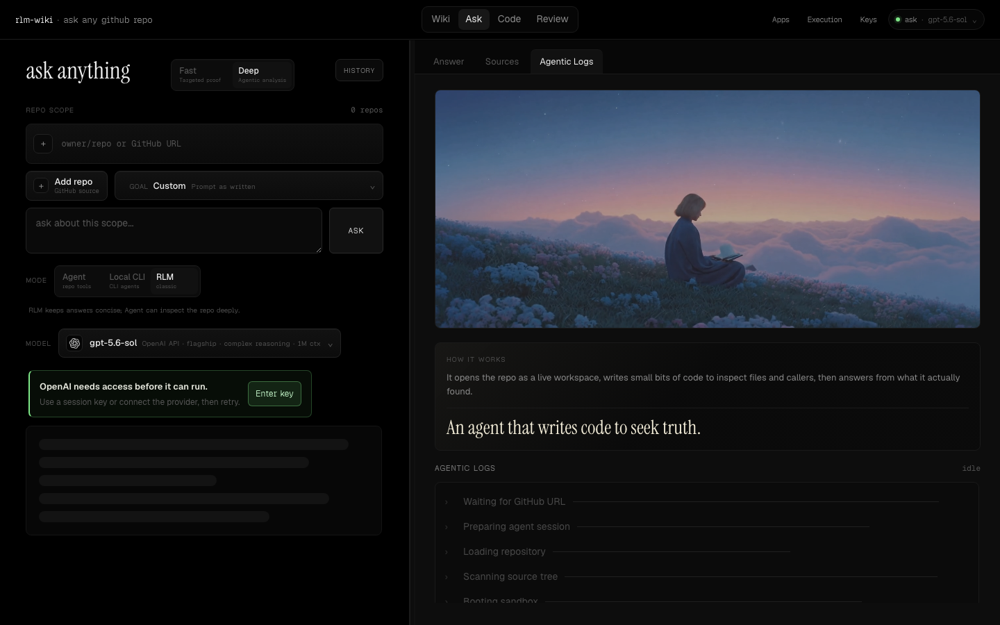
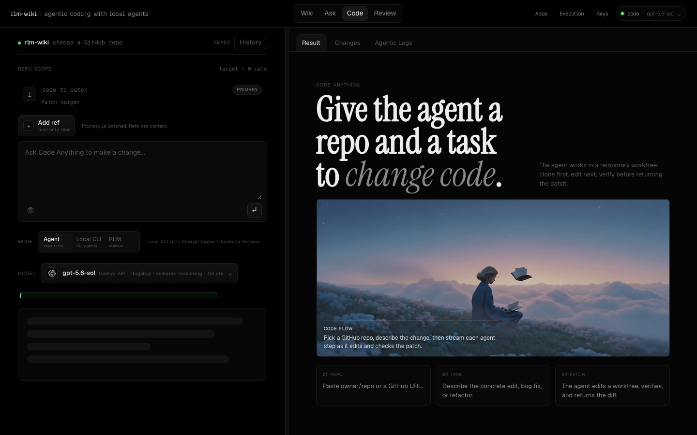
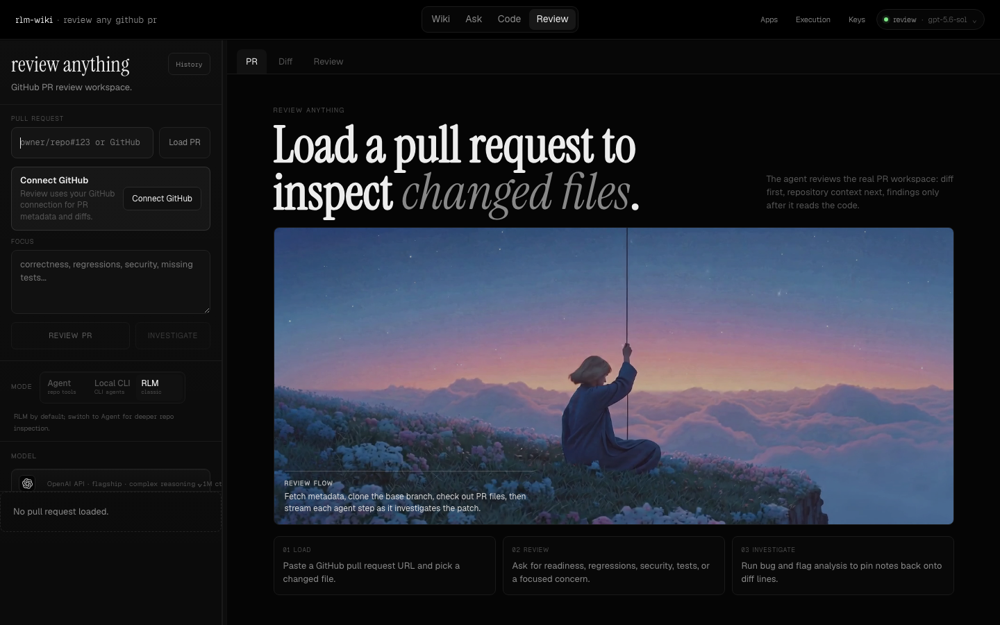

# rlm-wiki

I built this on nights and weekends. Not a product launch. Just a tool I wanted for myself, and then decided to leave open so other people could use it too.

The idea is simple: paste a GitHub repo, let an agent actually open the code, and get something useful back — a wiki, an answer, a patch, a PR review. No embedding index. No “we trained a graph on your monorepo.” The agent clones the repo and looks around, the way you would if you had a free afternoon and a lot of patience.

I hit my peak of wanting this when I was tired of opening five tabs, grepping by hand, and still not trusting the summary. So I wrote a small app that keeps the loop honest: read the tree, follow callers, write only what it can point at.

If that sounds useful, try it. If it doesn’t, no hard feelings.

## What it looks like

A few shots from a live local run:

### Home


### Ask a repo anything



### Code Anything



### Review



Wiki is the same family: paste a repo, get pages written from the real tree.

## What it does

- **Wiki** — multi-page technical wiki from a repo URL  
- **Ask** — questions with code-backed answers  
- **Code** — give it a task, get a patch from a temporary worktree  
- **Review** — pull request review / investigation  

Bring your own model keys. They stay in your browser. We don’t put them in a vault on our servers. They’re only sent with the run so the model can answer.

Live demo (when I’m keeping it up): [rlmwiki.deepascii.com](https://rlmwiki.deepascii.com)

## Run it yourself

You’ll need [Bun](https://bun.sh) and, for Agent mode, [JCODE](https://github.com/1jehuang/jcode).

```bash
# optional agent runtime
curl -fsSL https://raw.githubusercontent.com/1jehuang/jcode/master/scripts/install.sh | bash
jcode --version

bun install
cp .env.example .env
# put a key in the UI under Keys, or export one for local CLI:
# export GEMINI_API_KEY=...
# export OPENAI_API_KEY=...

bun run server
# open http://127.0.0.1:3141
```

CLI if you prefer a terminal:

```bash
bun ./bin/rlm-wiki.ts generate expressjs/express
bun ./bin/rlm-wiki.ts ask expressjs/express "How does routing work?"
bun ./bin/rlm-wiki.ts list
bun ./bin/rlm-wiki.ts serve --port 3141
```

## How it works (short version)

```text
GitHub URL
    → clone / open workspace
    → agent reads real files
    → wiki / answer / patch / review
```

Under the hood there are two runtimes:

- **Agent** — [JCODE](https://github.com/1jehuang/jcode) (preferred for Code)  
- **RLM** — vendored `rlm-bun` (still used in some wiki / ask / review paths)

You don’t have to care about that on day one. Pick a model, paste a repo, press the button.

## Keys

Open **Keys** in the top bar. Paste a provider key. Save.

That’s it. Local browser storage only. Clear anytime. Server-side env keys can still help for local CLI experiments; the web app itself expects you to bring keys in the browser.

## Layout

```text
rlm-wiki/
├── bin/rlm-wiki.ts      CLI
├── src/                 server + generators + runtimes
├── public/              web UI
├── vendor/rlm-bun/      legacy RLM runtime
├── docs/screenshots/    the pictures above
└── Dockerfile           one-box deploy
```

Longer notes live in [docs/](docs/README.md). Changelog in [CHANGELOG.md](CHANGELOG.md).

## Deploy (if you want a public box)

I run mine on Railway with the Dockerfile in this repo. Rough shape:

```bash
railway link
# BYOK in the browser for user runs
# optional: Cloudflare Access in front
railway up
```

Health check: `GET /api/health`.

Docker:

```bash
docker build -t rlm-wiki .
docker run --rm -p 3141:3141 rlm-wiki
```

## Honest limits

- GitHub-first. Not every forge.  
- Agent mode wants JCODE installed where the server runs.  
- Page failures don’t always stop the whole wiki run; a page can error and the rest continue.  
- This is a hobby project. Expect sharp edges. PRs and issues are welcome when something is truly broken.

## Why share it

I kept wanting a quieter loop: less magic, more “show me the file.” Building that for myself was enough reason. Opening the repo is the second step — so you can fork it, host it, or take one idea and put it somewhere better.

If you make something with it, I’d like to hear about it.

—
MIT license. Use it kindly.
